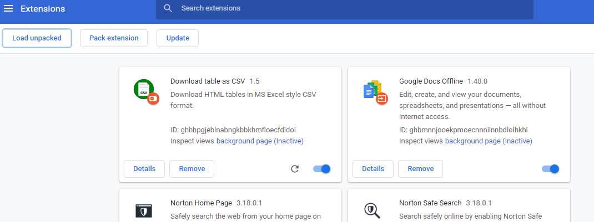

# table-csv-chrome

https://github.com/arktiv/table-csv-chrome のフォークになります。

公式からの変更点は、日本語等のマルチバイト文字が含まれても Excel で処理できるように UTF-8 BOM エンコーディングで保存するようにしています。

# 使い方
1. テーブルを右クリックして、「Download table as CSV」を選択するとテーブルが CSV として保存されます。

# インストール方法

1. この GitHub からソースコードをダウンロードします。

画面右上の「<> Code」をクリックし、「Download Zip」ボタンをクリックしてソースコードをダウンロードします。ダウンロード後は解凍して任意のフォルダへ保存してください。

2. Chrome を開き、アドレスバーに「 chrome://extensions/ 」と入力して拡張設定画面を表示します。

3. 拡張設定画面右上の「Developer mode」をクリックして開発者モードにします
4. 拡張設定画面左上の「Load Unpacked」ボタンをクリックして、先ほどダウンロードして解凍した「Download table as CSV」フォルダを選択します

5. 拡張設定画面に「Download table as CSV 1.5」と表示されればインストール完了です。

